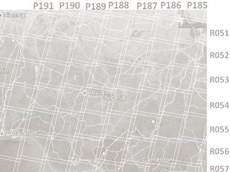
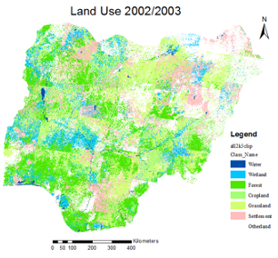
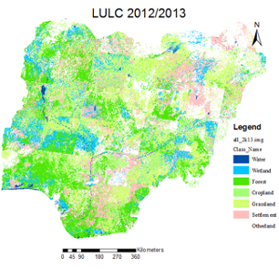
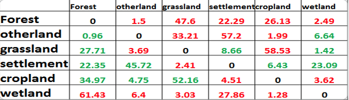

> In calculating the net emission/removal from the LULUCF sector, 2006 IPCC Guidelines was used. The 2006 guidelines are the latest step in the IPCC development of inventory guidelines for national estimates of greenhouse gases.

The land use area are divided into six distinctive categories, Forestland, Cropland, Grassland, Wetland, Settlements and Other lands and they are further sub-divided into “Land remaining in a land-use category” and “Lands converted to other lands”. Nigeria considered all land-categories in estimating greenhouse emissions and removals excluding Wetlands, although we accounted for the land area. This inventory accounted only for CO2 emissions and removals resulting from carbon stock changes in biomass, dead organic matter and mineral soils, for all managed lands. Non-CO2 emission sources on lands were not accounted.

The land areas in the period 2003 to 2013 are represented by spatially explicit land-use imageries (following approach 3 in gathering activity data; IPCC 2006). The 2006 IPCC Guidelines generally provide advice on estimation methods at three levels of detail, from tier 1 (the default method) to tier 3 (the most detailed method). The advice consists of mathematical specification of the methods, information on emission factors or other parameters to use in generating the estimates, and sources of activity data to estimate the overall level of net emissions (emission by sources minus removals by sinks). Properly implemented, all tiers are intended to provide unbiased estimates, and accuracy and precision should, in general, improve from tier 1 to tier 3. The provision of different tiers enables inventory compilers to use methods consistent with their resources and to focus their efforts on those categories of emissions and removals that contribute most significantly to national emission totals and trends (IPCC 2006).

## Land classes/ land-use definitions
Land-use category is the broad land use (one of the six land-use categories described below) reported as either land remaining in a land-use category (i.e., remaining in the same use throughout the inventory timeseries) or land converted to a new land-use category (representing a change in land use). The six broad land-use categories form the basis of estimating and reporting greenhouse gas emissions and removals from land use and land-use conversions. The categories (and sub-categories) are intended to be identified through use of Approaches for representing land-use area data.

Managed land is land where human interventions and practices have been applied to perform production, ecological or social functions. Emissions/removals of greenhouse gases do not need to be reported for unmanaged land. However, it is good practice for countries to quantify, and track over time, the area of unmanaged land so that consistency in area accounting is maintained as land-use change occurs (IPCC, 2006).

Approach 3 method of representing land was used, which is using spatially explicit land use conversion data. Data on land remaining land and land converted to other lands were obtained from spatial imageries and remote sensed data. Due to dataset constraints, this data was not spatially intersected with other spatial datasets, such as those on climate, vegetation type, soil and management strata.

## Approaches for the Representation of Lands
Multiple scenes of Landsat imagery were downloaded from http://www.glcf.org for two time periods (2002/2003 & 2012/2013) covering path 185 to 191 and rows 051 to 057. The Image scenes were selected to correspond to the same period (season). Additional image scenes were downloaded to enable choice of best scene (especially in coastal areas with lot of cloud cover).

Idrisi Selva and ArcGIS software were used for digital image processing. The images were pre-processed and colour composition was carried out on band 7, band 4, & band 2. A few field survey sites were visited across the country for ground trothing/ ground control Points (GCP) and reference points using GPS receivers. Google earth was also employed as ancillary data for visual interpretation and training pixels.

For all Landsat images acquired from 2003 upwards, a gap fill tool was used to solve the problem of scan line corrector (SLC) error, to fill the gap of missing data due to the lines.

Supervised classification using maximum likelihood was done on each Landsat scene and disaggregated into 7 classes, which are Forestland, Grassland, Cropland, Wetland, Settlement, Water and Other lands. All classification carried out was general in nature using visual image interpretation, guided by field survey of known geographic space and ancillary data from google earth.

Areas known as forest in real ground survey were used to train pixel for all other forests, this trend was repeated for the remaining six land-use categories respectively. In all cases no minimum mapping unit (MMU) was used.

Forest data had to be separated into managed and unmanaged forest. This was not readily derived from the satellite imageries, however, forest maps from the Federal Department of Forestry, showing managed forest (reserves and parks) were scanned and geo-referenced to scale. This was used to separate the area of managed forest from the unmanaged forest by subtracting the result of the reserved forest from the entire forest class.

The classified image scenes were mosaicked and the entire mosaic was clipped to the map outline of Nigeria, for the two time periods (2002/2003 & 2012/2013). The following figures show the land use classification for the entire country in the two time period (2002/2003 & 2012/2013)

Land use change was computed using the land change modeller plugin in Idrisi Selva to prepare a land use transition matrix. The table below shows the change matrix. Please note that the percentage change is that fraction of the loss or gain over the time series considered for inventory estimation and not the entire forest class. The transition matrix was used to determine land converted to other land across all land-use categories.

<figure>

  
  <figcaption>National Landuse Transition Matrix Percentage (%)</figcaption>
  

</figure>

## Results
The full results of this study is unpublished at this time. **It is currently being updated and will be made available to the public when completed.**